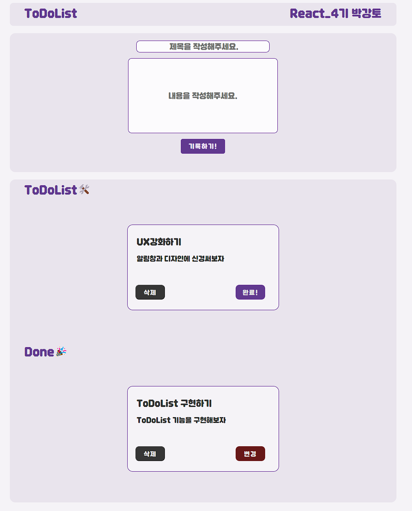

# React를 이용한 TodoList 제작입니다.

### 컴포넌트를 나눠서 작업을 진행했습니다.

- **App.jsx**에서는 **Main.jsx**와 **LayOut.jsx**만을 받아옵니다.

  - LayOut.jsx는 현재 헤더의 역할을 담당하고 있습니다.
  - Main.jsx는 하위 항목을 하나로 통합하고 있습니다.

- **Button.jsx** 는 이번 프로젝트에서 사용되는 모든 버튼을 호환합니다.

---

### components 폴더 내부의 ToDoList폴더에 세부사항을 나눴습니다.

- **AddList.jsx** 는 새로운 ToDoList 작성 기능이 구현되어 있습니다.
- **ReadyItem.jsx**는 변경사항 (삭제, 완료, 취소)의 기능이 구현되어 있습니다.
- **ListBox.jsx** 는 **ReadItem.jsx**의 기능을 이용한 공간 분배( yet, done)를 진행했습니다.

---

### CSS는 Flex로 작업이 되어있습니다.

- **reset.css** 를 적용했습니다.
- 폰트는 **눈누**(<https://noonnu.cc/>)에서 무료 웹폰트를 적용했습니다.
  - 폰트는 **던파 비트비트체v2** 를 사용했습니다.(<https://noonnu.cc/font_page/1233>)
- **Button**와 생성된 **ToDoList box**의 css에 hover 기능을 도입해서 가시성을 높였습니다.

---

### 사용자 편의성을 구현한 부분이 있습니다.

- **Button** 마다 각각의 상황에 맞는 alert확인을 삽입했습니다.
- ToDoList와 Done 항목에 일정이 존재하지 않을 시 각각의 텍스트를 삽입했습니다.

### 현재 미완성인 부분이 있습니다.

- ~~삭제 실행시 alert창에서 취소하는 기능을 구현하지 않았습니다.~~(해결!!)
- input:focus 을 적용하지 못했습니다.
- 40자 이상 넘어갈 경우 글자가 잘리는 현상이 있습니다.
  - 이 부분은 마우스를 hover할 때 width와 heigth값을 늘려주는 방식으로 대체하였습니다.

## 참고한 자료입니다.

> #### 내일 배움 캠프 강의
>
> #### isDone 제작참고 : https://youtu.be/0b7qs1P7re4?si=WxwEk0tcQjSZu7Fc
>
> React 공식문서
>
> #
